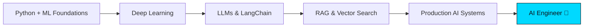

<!-- ===================== HEADER ===================== -->
<div align="center">

<a href="https://github.com/seharandleeb">
  
</a>

<br/>


&nbsp;
<a href="https://github.com/seharandleeb?tab=followers">
  
</a>

</div>

<!-- ===================== INTRO ===================== -->
<div align="center">

### `AI Engineer Intern @ Xeven Solutions` &nbsp;•&nbsp; `BS Artificial Intelligence (8th Sem)` &nbsp;•&nbsp; `Lahore, PK`

I design and build **applied AI systems** — from classical ML models to **LLM-powered, RAG-based applications**. I learn in public, ship daily, and document everything.

</div>


<!-- ===================== ABOUT ===================== -->
## 🧠 About Me

```python
class SeharAndleeb:
    def __init__(self):
        self.role        = "AI Engineer Intern @ Xeven Solutions"
        self.education   = "BS Artificial Intelligence — 8th Semester"
        self.focus       = ["Machine Learning", "Deep Learning", "LLMs", "RAG Systems"]
        self.currently   = "Building LLM apps with LangChain + Groq"
        self.philosophy  = "Learn in public. Ship every day. Stay curious."

    def daily_routine(self):
        return "Python → Jupyter → Documentation → Real Projects"
```


<!-- ===================== SKILLS ===================== -->
## 🛠️ Skills & Tech Stack

<div align="center">

**Languages & Core**


**AI / Machine Learning**


**LLMs & Generative AI**


**Tools & Environment**


</div>


<!-- ===================== PROJECTS ===================== -->
## 🚀 Featured Projects

| Project | Description | Tech |
|---|---|---|
| **[AI Internship — Xeven 2026](https://github.com/seharandleeb/ai-internship-xeven-2026)** | 30-day applied AI journey: daily scripts, notebooks & ML projects, fully documented | `Python` `ML` `Jupyter` |
| **[Heart Disease Prediction](https://github.com/seharandleeb/heart-disease-prediction)** | ML classification model on real clinical data | `scikit-learn` `Pandas` |
| **🔜 RAG Document Assistant** | *(planned)* Q&A over PDFs using LangChain + Groq + vector search | `LangChain` `RAG` `Groq` |
| **🔜 LLM Mini-App** | *(planned)* End-to-end LLM-powered app with a clean UI | `LangChain` `LLMs` |


<!-- ===================== GITHUB STATS ===================== -->
## 📊 GitHub Analytics

<div align="center">


<br/>


<br/>


</div>

<!-- Snake animation (requires GitHub Action — see setup notes) -->
<div align="center">


</div>


<!-- ===================== CURRENT LEARNING ===================== -->
## 📚 Currently Learning

- 🔗 **LangChain** — chains, agents, and tool calling with `langchain_groq`
- 🧩 **RAG Systems** — embeddings, vector stores, retrieval pipelines
- 🤖 **LLM Application Design** — prompt engineering & production patterns
- 📈 Deepening **Deep Learning** foundations (PyTorch / TensorFlow)


<!-- ===================== INTERNSHIP ===================== -->
## 💼 Internship Highlight — Xeven Solutions

> **AI Engineer Intern** | Structured 30-day accelerated AI/ML roadmap
>
> Building production-minded skills through **daily** hands-on work: Python scripting → Jupyter research notebooks → documented learnings → real ML & LLM projects. Every day committed publicly as a record of consistency and growth.
>
> 📂 Full journey: **[ai-internship-xeven-2026](https://github.com/seharandleeb/ai-internship-xeven-2026)**


<!-- ===================== FUTURE GOALS ===================== -->
## 🎯 AI Engineer Roadmap



- ✅ Master ML fundamentals & data workflows
- 🔄 Build & deploy real LLM + RAG applications
- 🎯 Specialize in **applied Generative AI / LLM engineering**
- 🌍 Contribute to open-source AI tooling


<!-- ===================== CONTACT ===================== -->
## 🤝 Let's Connect

<div align="center">

<a href="https://www.linkedin.com/in/sehar-andleeb518">
  
</a>
<a href="https://github.com/seharandleeb">
  
</a>
<a href="mailto:seharm518@example.com">
  
</a>

<br/><br/>

<i>Open to connecting with AI professionals, mentors, and fellow builders.</i>

</div>

<!-- ===================== FOOTER ===================== -->

