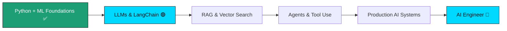

<!-- ===================== HEADER ===================== -->
<div align="center">

<a href="https://github.com/seharandleeb">
  
</a>

<br/>


&nbsp;
<a href="https://github.com/seharandleeb?tab=followers">
  
</a>

</div>

<!-- ===================== INTRO ===================== -->
<div align="center">

### `AI Engineer Intern @ Xeven Solutions` &nbsp;•&nbsp; `BS Artificial Intelligence (8th Sem)` &nbsp;•&nbsp; `Lahore, PK`

I design and build **applied AI systems** — from classical ML models to **LLM-powered, RAG-based applications**. I learn in public, ship daily, and document everything.

**Currently on Day 16 of 30 — LangChain agents with Groq** · [See full journey →](https://github.com/seharandleeb/ai-internship-xeven-2026)

</div>


<!-- ===================== ABOUT ===================== -->
## 🧠 About Me

```python
class SeharAndleeb:
    def __init__(self):
        self.role        = "AI Engineer Intern @ Xeven Solutions"
        self.education   = "BS Artificial Intelligence — 8th Semester"
        self.focus       = ["Machine Learning", "LLMs", "RAG Systems", "LangChain"]
        self.currently   = "Building LLM apps with LangChain + Groq (Day 16/30)"
        self.philosophy  = "Learn in public. Ship every day. Stay curious."

    def daily_routine(self):
        return "Python → Jupyter → LEARNINGS.md → Real Projects"
```


<!-- ===================== SKILLS ===================== -->
## 🛠️ Skills & Tech Stack

<div align="center">

**Languages & Core**


**AI / Machine Learning**


**LLMs & Generative AI**


**Tools & Environment**


</div>

> **Note on TensorFlow / PyTorch:** Removed from badges — list only tools you have actively used in a project. Add them back once you've built something with them.


<!-- ===================== PROJECTS ===================== -->
## 🚀 Featured Projects

| Project | What it does | Stack | Status |
|---|---|---|---|
| **[AI Internship — Xeven 2026](https://github.com/seharandleeb/ai-internship-xeven-2026)** | 30-day applied AI roadmap — daily scripts, notebooks, ML models, fully documented | `Python` `LangChain` `Groq` `Jupyter` | 🟢 Day 16/30 |
| **[Heart Disease Prediction](https://github.com/seharandleeb/heart-disease-prediction)** | Binary classification on UCI clinical dataset | `scikit-learn` `Pandas` `NumPy` | ✅ Complete |
| **RAG Document Assistant** | Q&A over PDFs using LangChain + Groq + vector search | `LangChain` `RAG` `Groq` | 🔜 Building next |
| **LLM Agent App** | End-to-end deployed LLM agent with tool use | `LangChain` `Groq` `Streamlit` | 🔜 Planned |


<!-- ===================== GITHUB STATS ===================== -->
## 📊 GitHub Analytics

<div align="center">


<br/>


<br/>


</div>

<!-- Snake animation — requires GitHub Action setup. Instructions: https://github.com/Platane/snk -->
<div align="center">

</div>


<!-- ===================== CURRENT LEARNING ===================== -->
## 📚 Currently Learning (Internship Day 16/30)

- 🔗 **LangChain** — chains, agents, and tool calling with `langchain_groq` + `llama-3.3-70b-versatile`
- 🧩 **RAG Systems** — embeddings, vector stores, retrieval pipelines
- 🤖 **LLM Application Design** — prompt engineering & production patterns
- 📊 **ML Fundamentals** — Pandas, NumPy, Scikit-learn on real datasets


<!-- ===================== INTERNSHIP ===================== -->
## 💼 Internship — Xeven Solutions

> **AI Engineer Intern** | 30-day accelerated AI/ML roadmap | June 2026
>
> Daily workflow: Python scripts → Jupyter research notebooks → `LEARNINGS.md` documentation → real ML & LLM projects. Every day committed publicly as a verifiable record of consistency and growth.
>
> 📂 Full journey: **[ai-internship-xeven-2026](https://github.com/seharandleeb/ai-internship-xeven-2026)**

**Progress snapshot:**

| Phase | Topics | Status |
|---|---|---|
| Days 01–07 | Python fundamentals, Git, data structures | ✅ Complete |
| Days 08–14 | Dicts, JSON, loops, OOP, file I/O | ✅ Complete |
| Days 15–16 | LLM fundamentals, LangChain setup | 🟢 In progress |
| Days 17–30 | RAG systems, agents, deployed LLM apps | 🔜 Upcoming |


<!-- ===================== ROADMAP ===================== -->
## 🎯 AI Engineer Roadmap



- ✅ ML fundamentals, data workflows, Python scripting
- 🟢 LLM apps with LangChain + Groq (active)
- 🔜 RAG pipelines, vector stores (ChromaDB / FAISS)
- 🔜 Deploy real AI apps (Streamlit / Hugging Face Spaces)
- 🎯 Contribute to open-source AI tooling


<!-- ===================== CONTACT ===================== -->
## 🤝 Let's Connect

<div align="center">

<a href="https://www.linkedin.com/in/sehar-andleeb518">
  
</a>
<a href="https://github.com/seharandleeb">
  
</a>
<a href="mailto:seharm518@gmail.com">
  
</a>

<br/><br/>

<i>Open to AI Engineer roles and collaborations — available from August 2026.</i>

</div>

<!-- ===================== FOOTER ===================== -->

