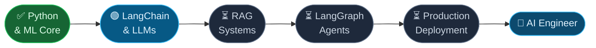

<div align="center">


<a href="https://github.com/seharandleeb">
  
</a>

<br/><br/>

<a href="https://www.linkedin.com/in/sehar-andleeb518"></a>
&nbsp;
<a href="mailto:seharm518@gmail.com"></a>
&nbsp;


</div>

---

## About

BS Artificial Intelligence student (8th semester) and AI Engineer Intern at **Xeven Solutions**, where I complete a structured 30-day applied ML and LLM roadmap — shipping code daily, documenting everything publicly.

My focus is applied Generative AI: building systems that are actually useful, not just impressive in a notebook. Right now that means LLM pipelines, retrieval-augmented generation, and LangGraph-based agents. My final year project is an **AI Healthcare Assistant** — a RAG-powered clinical decision support tool.

I learn in public. Every day is a commit. Every week is a deliverable.

---

## Experience

**AI Engineer Intern — Xeven Solutions** `June 2026 — Present`

30-day accelerated AI/ML program. Daily workflow: Python script → Jupyter notebook → `LEARNINGS.md` → mentor review. Tech stack: Python 3.13, UV, LangChain, Groq (`llama-3.3-70b-versatile`), Scikit-learn, Pandas, NumPy.

| Phase | Scope | Status |
|---|---|---|
| Days 01–07 | Python fundamentals, Git, data structures | ✅ |
| Days 08–14 | Dicts, JSON, loops, OOP, file I/O | ✅ |
| Days 15–16 | LLM fundamentals, LangChain setup | 🟢 Active |
| Days 17–30 | RAG systems, LangGraph agents, deployed apps | Upcoming |

→ Full journey: [ai-internship-xeven-2026](https://github.com/seharandleeb/ai-internship-xeven-2026)

---

## Tech Stack

```
Language        Python 3.13
LLM Frameworks  LangChain · LangGraph · Groq API
ML / Data       Scikit-learn · Pandas · NumPy
Environment     UV · Jupyter · VS Code
Version Control Git · GitHub
In Progress     RAG · Vector Stores · Streamlit · HuggingFace
```

<div align="center">


</div>

---

## Projects

### AI Healthcare Assistant *(Final Year Project — In Development)*
RAG-powered clinical decision support system. Patients describe symptoms; the system retrieves relevant medical knowledge from a curated vector store and returns structured, source-cited responses. Built with LangChain, LangGraph, and Groq.

`LangChain` `LangGraph` `RAG` `Groq` `Vector Store` `Streamlit`

---

### [Heart Disease Prediction](https://github.com/seharandleeb/heart-disease-prediction)
Binary classification on the UCI Heart Disease dataset. Feature engineering, model comparison (Logistic Regression, Random Forest, SVM), and evaluation with ROC-AUC.

`scikit-learn` `Pandas` `NumPy` `Jupyter`

---

### [AI Internship — Xeven 2026](https://github.com/seharandleeb/ai-internship-xeven-2026)
30-day public learning record: daily Python scripts, Jupyter research notebooks, and documented learnings from ML fundamentals through LangChain agents. Updated every day.

`Python` `LangChain` `Groq` `Scikit-learn` `Jupyter` `UV`

---

### RAG Document Assistant *(Coming soon)*
Q&A over private document collections. Upload PDFs, ask questions, get source-cited answers. LangChain + ChromaDB + Groq. Will be deployed on Hugging Face Spaces.

`LangChain` `ChromaDB` `Groq` `Streamlit`

---

## Current Focus

- **LangGraph** — stateful multi-agent workflows and graph-based orchestration
- **RAG architecture** — chunking strategies, embedding models, reranking, hybrid retrieval
- **LLM evaluation** — building reliable evals for open-ended generative outputs
- **Production patterns** — structured outputs, tool calling, observability with LangSmith

---

## AI Engineering Roadmap



---

## Open Source Goals

I am new to open source but building toward meaningful contributions:

- Document the RAG Healthcare project publicly as a reusable template
- Contribute bug fixes or documentation to LangChain ecosystem repos
- Publish utility scripts from the internship as standalone tools
- Share evaluation frameworks for LLM pipelines

---

## GitHub Stats

<div align="center">


<br/>


<br/>


</div>

<!-- Snake animation requires a GitHub Action. Setup: https://github.com/Platane/snk -->
<div align="center">

</div>

---

## Contact

I am actively looking for AI Engineer roles starting **August 2026**.

If you are building something in the LLM / RAG / Agentic AI space and want someone who ships daily and documents rigorously — let's talk.

<div align="center">

<a href="https://www.linkedin.com/in/sehar-andleeb518">
  
</a>
&nbsp;&nbsp;
<a href="mailto:seharm518@gmail.com">
  
</a>

</div>

<br/>


